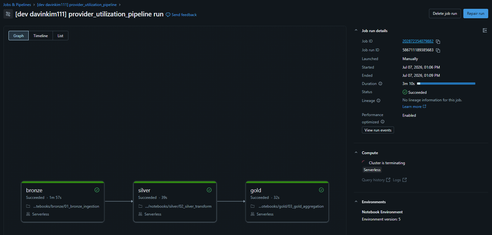
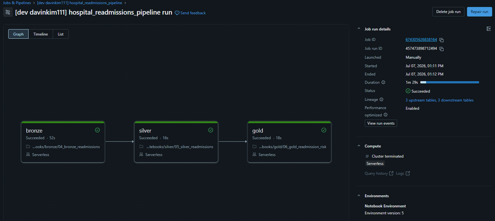
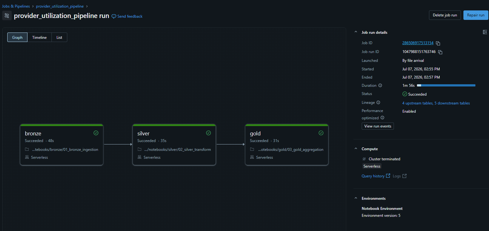
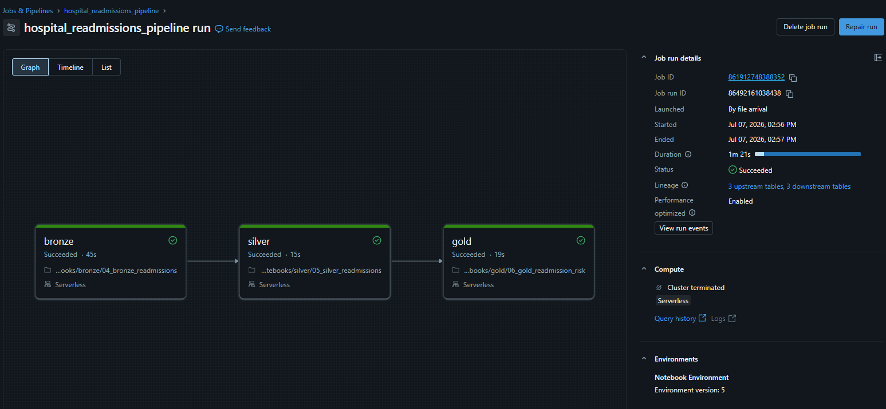

# CMS Medicare Provider Analytics Pipeline

A production-grade batch data pipeline built on Azure Databricks that ingests, transforms, and aggregates 9.7 million CMS Medicare provider records to analyze healthcare cost variation and hospital readmission risk across California providers.

## Business Questions Answered
- Which California providers have the highest cost variation for common procedures?
- Which California hospitals have the highest readmission risk by condition?

## Architecture

```
Track 1 — Provider Utilization
CMS Provider CSV → bronze.provider_utilization_raw
               → silver.providers + silver.procedures
               → gold.provider_cost_scorecard ✅

Track 2 — Hospital Readmissions
CMS Readmissions CSV → bronze.readmissions_raw
                    → silver.readmissions
                    → gold.hospital_readmission_risk ✅

Both tracks orchestrated in parallel via Lakeflow Jobs, deployed and managed
entirely through Databricks Asset Bundles (declarative YAML, not UI-created)
Trigger: File arrival (Azure Event Grid, UC-managed file events) → job fires when new CSV lands in ADLS
Unity Catalog — Governance, lineage, access control across all layers, all compute types
Compute: 100% Serverless — no classic/dedicated clusters in the deployed pipeline
```

## Tech Stack

| Layer | Technology |
|---|---|
| Cloud Platform | Microsoft Azure |
| Data Lake | Azure Data Lake Storage Gen2 |
| Compute | Azure Databricks (Premium), **Serverless only** |
| Table Format | Delta Lake |
| Ingestion | Auto Loader (cloudFiles), `Trigger.AvailableNow()` |
| Language | PySpark + Spark SQL |
| Governance | Unity Catalog (storage credentials and external locations for all ADLS access) |
| Orchestration | Lakeflow Jobs (parallel DAG, file arrival trigger via UC-managed file events) |
| CI/CD | Databricks Asset Bundles (aka *Declarative Automation Bundles* in current docs; same CLI/YAML, renamed by Databricks) + GitHub |
| Cloud Auth | Azure Managed Identity via Access Connector for Azure Databricks (no storage account keys) |
| Performance | Liquid Clustering |
| Event Driven | Azure Event Grid + Storage Queue, managed through UC external location file events |

## Datasets

### Track 1 — Provider Utilization
**Source:** CMS Medicare Physician & Other Practitioners by Provider and Service
**URL:** https://data.cms.gov/provider-summary-by-type-of-service/medicare-physician-other-practitioners
**Size:** ~492MB CSV, 9,781,673 rows (original source), 29 columns
**Update frequency:** Annually · **Year:** 2024

### Track 2 — Hospital Readmissions
**Source:** CMS Hospital Readmissions Reduction Program (HRRP)
**URL:** https://data.cms.gov/provider-data/dataset/9n3s-kdb3
**Size:** ~1MB CSV, 18,330 rows (original source), 12 columns
**Update frequency:** Annually · **Year:** FY2026

**Data freshness note:** Both sources are updated on an annual cycle, not continuously. The provider utilization dataset is 100% final-action claims data: CMS only publishes it once every claim adjustment for a performance year is fully resolved, which is why the most recent available file is dated 2024 even though the catalog page itself updates more frequently. Readmissions data is tied to CMS's annual IPPS Final Rule cycle, released each fiscal year after a 30-day hospital review-and-correction period. File-arrival triggers were chosen because they react whenever a new file actually lands, instead of guessing a cron schedule against an external publisher's release calendar.

**Why table row counts exceed the original source counts:** both bronze tables carry a small number of additional rows beyond the two source files above, because both file-arrival triggers were verified live in production. Real subsets of the original data were dropped into ADLS a second time to prove each trigger fires automatically on file arrival rather than only when run by hand. See [Live File-Arrival Trigger Verification](#live-file-arrival-trigger-verification) below for the full test and its evidence.

## Pipeline Status

| Notebook | Status | Compute | Output |
|---|---|---|---|
| 01_bronze_ingestion | ✅ Complete | Serverless | `bronze.provider_utilization_raw` |
| 02_silver_transform | ✅ Complete | Serverless | 96,367 providers · 832,539 procedures · 22 quarantined |
| 03_gold_aggregation | ✅ Complete | Serverless | 832,539 rows → `gold.provider_cost_scorecard` |
| 04_bronze_readmissions | ✅ Complete | Serverless | `bronze.readmissions_raw` |
| 05_silver_readmissions | ✅ Complete | Serverless | 1,662 rows · 277 CA hospitals · 6 conditions · deduplicated |
| 06_gold_readmission_risk | ✅ Complete | Serverless | 1,662 rows → `gold.hospital_readmission_risk` |
| Lakeflow Jobs orchestration | ✅ Complete | Serverless | Two independent bundle-managed jobs, deployed to `dev` and `prod`, file-arrival trigger verified live in production |

**Verified job runs:**

| Job | Trigger Type | Bronze | Silver | Gold | Total | Result |
|---|---|---|---|---|---|---|
| `provider_utilization_pipeline` (dev) | Manual | 45s | 44s | 34s | 2m 6s | ✅ Succeeded |
| `hospital_readmissions_pipeline` (dev) | Manual | 52s | 16s | 18s | 1m 29s | ✅ Succeeded |
| `provider_utilization_pipeline` (prod) | **By file arrival** | 43s | 35s | 30s | 1m 51s | ✅ Succeeded |
| `hospital_readmissions_pipeline` (prod) | **By file arrival** | 1m 18s (2 attempts*) | 13s | 18s | 3m 40s | ✅ Succeeded |

*\*First attempt intentionally failed and auto-retried, which is expected Auto Loader schema-evolution behavior when a new file's schema doesn't match the previously locked schema, not a pipeline defect. See [Incident 5](#incident-5--test-data-header-mismatch-against-source-schema-not-bronze-schema).*

## Unity Catalog Structure

```
cms_medicare_databricks_pipeline
  ├── bronze
  │     ├── provider_utilization_raw       ✅  9,781,693 rows (9,781,673 original + 20 live trigger test)
  │     └── readmissions_raw               ✅  18,350 rows (18,330 original + 20 live trigger test)
  ├── silver
  │     ├── providers                      ✅  96,367 unique CA providers (unchanged — deduplicated on provider_npi)
  │     ├── procedures                     ✅  832,539 clean rows (unchanged — deduplicated on provider_npi + hcpcs_code + place_of_service)
  │     ├── procedures_quarantine          ✅  22 quarantined rows
  │     └── readmissions                   ✅  1,662 rows · 277 CA hospitals (unchanged — deduplicated on facility_id + measure_name, most recent by ingestion_timestamp)
  └── gold
        ├── provider_cost_scorecard        ✅  832,539 rows · liquid clustered
        └── hospital_readmission_risk      ✅  1,662 rows · liquid clustered
```

## Key Data Facts

| Metric | Value |
|---|---|
| National Medicare provider rows ingested (bronze, incl. live trigger test) | 9,781,693 |
| California rows after filter | 832,561 (8.51% of national) |
| Unique California providers | 96,367 |
| Clean procedure rows | 832,539 |
| Quarantined rows (invalid payment) | 22 (0.003% quality rate) |
| Average procedures per provider | ~8.6 |
| OC high cost outliers identified | 18,678 |
| Max cost deviation found | +1,473% above state average |
| Hospital readmission rows ingested (bronze, incl. live trigger test) | 18,350 |
| CA hospitals tracked in HRRP | 277 |
| Conditions tracked | 6 (AMI, CABG, COPD, HF, Hip/Knee, Pneumonia) |
| High risk hospital-condition pairs | 260 |
| Low risk hospital-condition pairs | 258 |
| Average risk hospital-condition pairs | 520 |

## Key Findings — Provider Cost Scorecard

Top Orange County high-cost outliers identified by the pipeline:

| Provider | City | Procedure | OC Payment | State Avg | Deviation |
|---|---|---|---|---|---|
| Mission Ambulatory Surgicenter | Mission Viejo | Bone marrow biopsy | $902.79 | $57.38 | +1,473% |
| Pegasus Surgery Center | Newport Beach | Brain neurostimulator insertion | $19,847.74 | $1,551.04 | +1,179% |
| Main Street Specialty Surgery Center | Orange | Harvest of graft from small bone | $3,768.61 | $341.89 | +1,002% |
| Specialty Surgical Center of Irvine | Irvine | Penile implant insertion | $13,010.24 | $1,836.85 | +608% |

*Cost deviation measured against California IQR benchmark using standardized payment amounts adjusted for geographic cost differences.*

**Grain note:** `gold.provider_cost_scorecard` is a provider × procedure × place-of-service table (832,539 rows across 96,365 distinct providers, ~8.6 rows/provider), not a single row per provider. Each row compares one provider's cost for one specific procedure against the statewide benchmark for that same procedure, which is what actually answers the business question ("which providers are outliers for *which* procedures").

## Key Findings — Hospital Readmission Risk (FY2026)

California hospitals ranked by average excess readmission ratio:

| Condition | CA Avg Excess Ratio | Interpretation | High Risk Hospitals |
|---|---|---|---|
| Pneumonia | 1.0262 | 2.62% above expected | included in 260 total |
| Heart Failure | 1.0171 | 1.71% above expected | 59 high risk |
| Heart Attack (AMI) | 1.0154 | 1.54% above expected | 35 high risk |
| CABG | 1.0052 | Essentially at expected | 22 high risk |
| COPD | 1.0023 | Essentially at expected | 50 high risk |
| Hip & Knee | 0.9788 | 2.12% BETTER than expected ✅ | — |

Top CA hospitals by AMI (Heart Attack) readmission risk:
1. Good Samaritan Hospital
2. Centinela Hospital Medical Center
3. Washington Hospital
4. Valley Presbyterian Hospital
5. Regional Medical Center of San Jose

*Excess readmission ratio > 1.0 = more readmissions than CMS expects = potential Medicare payment penalty.*

## Live File-Arrival Trigger Verification

Both `dev` and `prod` orchestration was verified with real, screenshotted evidence rather than assumed to work from a successful `bundle deploy`.

**Dev target**: verified via manual `databricks bundle run`, confirming the full bronze → silver → gold task chain, dependencies, and Serverless compute all execute correctly end to end.




**Prod target**: verified with an actual file drop into ADLS and zero manual triggering. Both jobs show `Launched: By file arrival` in their run details, confirming the Unity Catalog file-events + Azure Event Grid trigger chain fires autonomously in production, as designed.




The first live test attempt on the readmissions track surfaced a genuine bug in the test methodology, not the pipeline (see [Incident 5](#incident-5--test-data-header-mismatch-against-source-schema-not-bronze-schema)), which was found, root-caused, and fixed before the verification above was captured.

## Authentication & Governance Architecture (current)

All ADLS access, including bronze ingestion, is governed entirely through **Unity Catalog external locations**, backed by an **Azure Managed Identity** via an **Access Connector for Azure Databricks**. There is no storage account key, secret scope, or `spark.conf`-based authentication anywhere in this pipeline.

- **Storage credential**: `cms_medicare_raw_credential`, an Azure Managed Identity, connected through `unity-catalog-access-connector`.
- **External location**: `cms-medicare-data-storage`, scoped to `abfss://cms-medicare-raw@cmsmedicaredatastorage.dfs.core.windows.net/`, with **file events enabled** for file arrival triggers.
- **IAM roles granted to the Access Connector's managed identity:**
  - `Storage Blob Data Contributor`: on the storage account (read/write data)
  - `Storage Queue Data Contributor`: on the storage account (file event queue operations)
  - `EventGrid Data Contributor`: on the storage account (managed Event Grid subscription setup)
  - `EventGrid EventSubscription Contributor`: on the resource group
  - `Microsoft.EventGrid` resource provider registered on the Azure subscription
- **Compute**: every notebook (bronze, silver, and gold, for both tracks) runs on **Serverless compute**. Auto Loader in bronze uses `Trigger.AvailableNow()`, which processes everything available since the last checkpoint and exits. That's the exact triggered/incremental streaming pattern Serverless is designed for, so there's no technical reason to keep a warm classic cluster running between file arrivals.
- Bronze, silver, and gold all authenticate the same way: UC vends short-lived credentials automatically the moment code touches a governed `abfss://` path or a UC-managed Delta table. No notebook contains any authentication code.
- **Orchestration**: both jobs are defined as code in `resources/*.yml` and deployed via `databricks bundle deploy` rather than created in the UI. Job definitions, task dependency chains, and trigger configuration all live in version control and are fully reproducible from a clean workspace (see [Setup & Reproduction](#setup--reproduction)). `dev` and `prod` are deployed and left running side by side, which is standard practice rather than temporary staging. `dev`'s trigger stays paused by design (`mode: development`), so only `prod` fires on real file arrivals.

## Incidents & Debugging Log

Five distinct issues surfaced while moving from "notebooks work individually" to "notebooks work as an orchestrated, bundle-deployed, trigger-driven production system." Each is a different category of bug, and each was invisible until a specific new execution path exercised it for the first time.

### Incident 1 — Credential Conflict (Legacy Auth vs. Unity Catalog)

**What went wrong:** While building each medallion layer individually, bronze ingestion ran using a **storage account key** injected into the job cluster's Spark config via a Databricks secret scope (`fs.azure.account.key.<storage>.dfs.core.windows.net {{secrets/...}}`). This is the legacy, pre-Unity-Catalog way of authenticating to ADLS, and at that point it worked, because each notebook ran in isolation and nothing was yet exercising the code path where Unity Catalog's own credential system got involved.

Once orchestration testing began, bronze started throwing:
```
PERMISSION_DENIED: The credential 'cms_medicare_databricks_pipeline' is a workspace
default credential that is only allowed to access data in the following paths:
'abfss://unity-catalog-storage@dbstorageu25jgq5vd3tok.dfs.core.windows.net/...'
```

**Root cause:** On Unity-Catalog-enabled compute, every `abfss://` filesystem call is intercepted by UC and resolved through UC's own credential system first, before any legacy `spark.conf` key setting is ever consulted. That stops a raw storage key from being used to route around UC's governance and audit trail. Once orchestration exercised the code path where this interception fired, UC looked for a governing external location for the raw data path, found none correctly wired to it, and fell back to the catalog's auto-generated default managed-storage credential, which is scoped only to Databricks' own internal storage container, not the ADLS account. The key itself hadn't broken. It had simply stopped being consulted the moment the right conditions were met, with nothing in the logs to flag the change.

**The actual mistake:** treating storage-account-key auth and Unity Catalog governance as compatible when they aren't. External locations exist to *replace* the secret-scope-key pattern rather than sit alongside it. Silver and gold never hit this because they only touched UC-managed Delta tables and never read raw ADLS paths directly, which is also why the bug stayed invisible until orchestration exercised bronze's raw storage read for the first time.

**How I debugged it:**
1. Read the full stack trace instead of just the top-line error: the credential name in the error (`cms_medicare_databricks_pipeline`) matched my catalog name exactly, which was the tell that it was the catalog's auto-generated default credential and not a real one I'd created.
2. Ran `SHOW STORAGE CREDENTIALS` and `SHOW EXTERNAL LOCATIONS` to see what UC objects actually existed, rather than assuming.
3. Ran `DESCRIBE EXTERNAL LOCATION` and confirmed its `credential_name` pointed at the wrong (default) credential.
4. Created a dedicated storage credential (`cms_medicare_raw_credential`) backed by an Access Connector, and repointed the external location at it.
5. Hit a secondary error swapping credentials via the UI (`Cannot update external location... because the external location has dependent managed file event queue`), resolved via the Databricks SDK's `force=True` option (`w.external_locations.update(..., force=True)`), which isn't exposed in Catalog Explorer's UI.
6. Verified the fix with **Test Connection** in Catalog Explorer (Read/List/Write/Delete/Path Exists/Hierarchical Namespace/File Events Read: all green) before touching the notebook again.
7. Removed the leftover `spark.conf` key setting, confirmed Dedicated access mode, cleared stale checkpoints, and re-ran bronze end-to-end.
8. Once bronze worked, tested whether it needed Dedicated compute at all: an isolated throwaway test on **Serverless** confirmed a full 9.78M-row read/write succeeded, so both bronze notebooks were migrated to Serverless permanently.

### Incident 2 — UC-Blocked Function Surfaced Only Under Real Orchestration

**What went wrong:** The first fully bundle-orchestrated job run of `provider_utilization_pipeline` failed at the "Add metadata columns" step in bronze, with:
```
[UC_COMMAND_NOT_SUPPORTED.WITH_RECOMMENDATION] The command(s): input_file_name are
not supported in Unity Catalog. Please use _metadata.file_path instead. SQLSTATE: 0AKUC
```
This was surprising because an earlier isolated Serverless verification test (used to confirm Serverless could handle the 9.78M-row Auto Loader read before migrating off Dedicated compute) had already succeeded on Serverless.

**Root cause:** `input_file_name()` is a legacy Spark function, fully disabled under Unity Catalog's fine-grained access control enforcement on Standard/Shared access mode and Serverless compute. It can still work on Dedicated/Single-User clusters, which enforce UC restrictions more loosely. The earlier isolated Serverless test only exercised the Auto Loader **read** path (`spark.readStream...load()`), which was the actual risk being validated at the time. The "Add metadata columns" cell, which uses `F.input_file_name()` for lineage and auditing, was added afterward and had never actually executed on Serverless until the real job ran it for the first time.

**The actual lesson:** a passing isolated test only validates the code paths it actually exercises. The test proved Auto Loader and Serverless could handle the row count. It didn't prove every downstream transformation cell in the full notebook was Serverless-compatible.

**Fix:** replaced the deprecated call in both `01_bronze_ingestion` and `04_bronze_readmissions`:
```python
# Before
F.input_file_name().alias("source_file")

# After
F.col("_metadata.file_path").alias("source_file")
```

### Incident 3 — Checkpoint/Table State Drift Caused Silent Row Duplication

**What went wrong:** After Incident 2's fix, the redeployed job succeeded end-to-end, but a post-run verification query returned `19,563,346` rows in `bronze.provider_utilization_raw`, exactly double the documented baseline of `9,781,673`.

**Root cause:** During the Incident 1 credential debugging, the Auto Loader checkpoint at `.../_checkpoints/bronze_provider/` was deliberately cleared to force reprocessing after the auth fix, which was the correct move at the time. However, the `bronze.provider_utilization_raw` table itself was never truncated to match. `DESCRIBE HISTORY` confirmed two separate `STREAMING UPDATE` operations, each appending the full `9,781,673` rows, from two different notebook execution contexts days apart. With `outputMode("append")` and no checkpoint memory of the file, Auto Loader did exactly what it was built to do: it reprocessed a file it had no record of ever ingesting and doubled the table, without throwing a single error.

**The actual lesson:** checkpoint state and target table state are a matched pair and must be reset together. Clearing one without the other produces duplicated or missing data with zero errors thrown anywhere in the pipeline. Every silver and gold aggregation built on top of it just computes the wrong numbers, with nothing in the pipeline to flag it.

**Fix:** a full reset across both tracks: dropped all six bronze/silver/gold tables, cleared every checkpoint directory, redeployed, reran both jobs from a clean state, and verified every table's row count against its documented baseline.

### Incident 4 — Missing Deduplication in Readmissions Silver Layer (Found Proactively)

**What went wrong:** While auditing the pipeline before the live trigger test, not after a real failure, a code review of `02_silver_transform` versus `05_silver_readmissions` showed the provider track deduplicates on business keys (`dropDuplicates(["provider_npi"])`, `dropDuplicates(["provider_npi", "hcpcs_code", "place_of_service"])`), but the readmissions track had no equivalent. `05_silver_readmissions` was a straight `CREATE OR REPLACE TABLE AS SELECT` with filtering and no dedup step at any layer, and `06_gold_readmission_risk` selects straight through from silver with no aggregation that would incidentally absorb duplicates either.

**Why it mattered:** bronze is intentionally append-only and expected to accumulate re-ingested or overlapping data over time (re-triggers, corrections, retries). Without a dedup layer somewhere downstream, any duplicate rows in bronze, whether accidental or a legitimate CMS data correction, would flow straight through silver and gold unfiltered, double-counting hospitals in the very `AVG()`/`PERCENTILE()` benchmarks every hospital gets compared against.

**Fix:** added a dedup pass as a new cell after the existing table-build query in `05_silver_readmissions`, intentionally left as an additive second pass rather than restructuring the existing working query, to minimize risk to already-verified logic:
```sql
CREATE OR REPLACE TABLE cms_medicare_databricks_pipeline.silver.readmissions AS
SELECT * EXCEPT (rn)
FROM (
    SELECT *,
        ROW_NUMBER() OVER (
            PARTITION BY facility_id, measure_name
            ORDER BY ingestion_timestamp DESC
        ) AS rn
    FROM cms_medicare_databricks_pipeline.silver.readmissions
)
WHERE rn = 1
```
Keyed on `facility_id + measure_name` (the correct grain: one row per hospital per condition), keeping the most recent row by `ingestion_timestamp` rather than an arbitrary one, which handles both accidental duplicate ingestion and legitimate CMS data corrections with the same logic. Verified against baseline (`1,662` rows, `277` hospitals, `6` conditions) with no change post-fix, confirming the fix didn't alter existing correct data.

### Incident 5 — Test Data Header Mismatch Against Source Schema, Not Bronze Schema

**What went wrong:** The first live file-arrival trigger test used a readmissions test file exported directly from `bronze.readmissions_raw` via SQL editor, with clean snake_case headers (`facility_name`, `facility_id`, etc.). The job succeeded and row counts matched expectations, but a content preview showed every real field null for the new rows. Only the pipeline's own audit columns (`ingestion_timestamp`, `source_file`) were populated.

**Root cause:** `04_bronze_readmissions` selects columns by their **original CMS source header names** (`Facility Name`, `Facility ID`, spaces and title case) and renames them to snake_case as part of ingestion. The rename happens *at* ingestion, not before it:
```python
F.col("Facility Name").alias("facility_name"),
F.col("Facility ID").alias("facility_id"),
...
```
The test file's headers were already renamed (sourced from the post-transformation bronze table), so `F.col("Facility Name")` found no matching column in the new file and returned null for every affected row, with no error raised, since Spark's CSV parser in PERMISSIVE mode nulls unparseable records rather than failing the job. Row counts still matched because the row *existed*. Only its content was empty. Two of twelve columns (`state`, `footnote`) coincidentally survived because those specific original CMS header names happened to already be lowercase single words, identical to their bronze aliases.

**The actual lesson:** test data must mirror the true *upstream* schema a pipeline expects to receive, not the schema it happens to produce downstream. Exporting from an already-transformed table and re-injecting it at the raw ingestion point breaks any pipeline that renames or reshapes columns during ingestion. There's no error message, just null values where real data should be, which makes it easy to miss if only row counts get checked.

**Fix:** rebuilt the test file with the original CMS-style headers (`Facility Name`, `Facility ID`, `State`, `Measure Name`, ...), keeping the same underlying data rows unchanged. Re-ran the full six-table reset to clear the null rows from the failed attempt, re-tested with the corrected file, and this time verified actual row **content** (not just counts) before considering the trigger test passed.

## What I Learned

- **Legacy auth patterns and Unity Catalog can conflict without any warning, and UC wins.** If a pipeline is meant to be UC-governed, every storage path needs a proper external location from the start. A storage key sitting alongside UC is a latent bug, not a fallback.
- **A bug can be invisible until a different execution path exercises it.** This happened repeatedly in this project, in different forms: silver/gold looked "done" while bronze's auth was broken because they never touched raw ADLS; the metadata-columns cell looked "done" because it had never actually run on Serverless; and the readmissions dedup gap looked fine because nothing had ever actually sent it duplicate data. Testing individual notebooks in isolation isn't the same as testing the orchestrated system, and a passing test only proves what it actually ran.
- **Matching row counts doesn't mean the data is correct.** The Incident 5 test file matched the expected row count exactly while every meaningful column came back null. Trusting a pipeline run means verifying content, not just counts.
- **Test data has to mirror the true upstream schema, not whatever schema is easiest to export.** Sourcing test data from a downstream, already-transformed table can break any pipeline stage that reshapes data during ingestion, with no error to point at the cause.
- **Read the exact object name in a permission error.** The credential name matching my catalog name was the single clue that made the root cause obvious instead of a long guessing exercise.
- **UI dead ends usually have an API escape hatch.** The `force` option for updating a credential with a dependent file event queue exists on the SDK/API but not in Catalog Explorer's UI.
- **Compute choice should follow workload shape, not habit.** `Trigger.AvailableNow()` combined with a file-arrival trigger is a triggered, incremental pattern rather than a continuously polling one, which is exactly what Serverless is built for. Matching compute type to trigger semantics is what eliminated the idle-cost problem.
- **State that lives outside the table, like checkpoints in this case, has its own lifecycle.** Deleting a checkpoint changes what the next run considers "already processed." Any time a checkpoint is reset, the table it feeds needs the same reset, or the two drift out of sync with nothing to flag it.
- **Dedup logic needs to exist wherever duplicate data could plausibly arrive, not just where it happened to be built first.** Building the same defensive pattern once (provider track) doesn't mean it exists everywhere it's needed. It's worth an explicit audit pass across parallel pipelines rather than assuming symmetry.
- **Declarative deployment and live trigger testing surface bugs that manual runs hide.** Every incident from #2 onward only appeared once jobs were actually deployed via Databricks Asset Bundles and either run as real orchestrated jobs or triggered by a genuine file arrival. The bundle and the trigger didn't cause these bugs. They exposed them, by running the exact compute, sequence, and data-arrival conditions production actually uses, instead of whatever ad hoc cluster, cell order, or hand-picked test data got used during manual development.

## Setup & Reproduction

### Prerequisites
- Azure subscription (free tier works)
- Azure Databricks workspace (Premium tier)
- Azure Data Lake Storage Gen2, hierarchical namespace enabled
- Databricks CLI installed locally (`brew install databricks/tap/databricks`, or see [Databricks CLI install docs](https://docs.databricks.com/en/dev-tools/cli/install.html))

### Step 1 — Azure Infrastructure
1. Create Azure Databricks workspace (Premium tier).
2. Create ADLS Gen2 storage account with hierarchical namespace enabled; create container `cms-medicare-raw`.
3. Create an **Access Connector for Azure Databricks** (system-assigned managed identity).
4. Assign the connector's managed identity these IAM roles:
   - `Storage Blob Data Contributor`: on the storage account
   - `Storage Queue Data Contributor`: on the storage account
   - `EventGrid Data Contributor`: on the storage account
   - `EventGrid EventSubscription Contributor`: on the resource group
5. Register the `Microsoft.EventGrid` resource provider on the Azure subscription.

### Step 2 — Unity Catalog Configuration
1. Confirm the workspace is Unity Catalog enabled (auto-enabled on workspace creation in current Databricks).
2. Create schemas: `bronze`, `silver`, `gold` in the catalog.
3. Create a **storage credential** (Catalog → External Data → Credentials) of type Azure Managed Identity, referencing the Access Connector's resource ID from Step 1.
4. Create an **external location** pointing at `abfss://cms-medicare-raw@<storage-account>.dfs.core.windows.net/`, using that storage credential, with **file events enabled** (Automatic mode).
5. Grant `READ FILES` / `WRITE FILES` on the external location to the identities that need it.
6. No secret scopes, no storage keys, no `spark.conf` authentication anywhere.

### Step 3 — Data
1. Download the CMS Medicare Provider dataset from data.cms.gov (2024).
2. Upload the CSV to `cms-medicare-raw/provider_utilization/` in ADLS.
3. Download the CMS HRRP dataset from data.cms.gov (FY2026).
4. Upload the CSV to `cms-medicare-raw/readmissions/` in ADLS.

### Step 4 — Deploy and Run
1. Authenticate the CLI (OAuth U2M, opens a browser login):
   ```bash
   databricks auth login --host https://<your-workspace-url>.azuredatabricks.net
   ```
2. Set the real workspace host in **both** the `dev` and `prod` targets of `databricks.yml`.
3. Validate and deploy to `dev` first. `mode: development` prefixes job names (e.g. `[dev you] provider_utilization_pipeline`) and **pauses file-arrival triggers automatically**, so nothing fires against real data while you're verifying:
   ```bash
   databricks bundle validate -t dev
   databricks bundle deploy -t dev
   databricks bundle run provider_utilization_pipeline -t dev
   databricks bundle run hospital_readmissions_pipeline -t dev
   ```
4. Once verified, deploy to `prod`. Production mode requires an explicit `workspace.root_path` in `databricks.yml`. DAB will refuse to deploy without it, to guarantee exactly one canonical copy of production resources instead of creating parallel copies per deploying user without any warning:
   ```yaml
   targets:
     prod:
       mode: production
       workspace:
         host: https://<your-workspace-url>.azuredatabricks.net
         root_path: /Workspace/Users/<your-email>/.bundle/${bundle.name}/${bundle.target}
   ```
   ```bash
   databricks bundle deploy -t prod
   ```
   File-arrival triggers go live the moment this deploy succeeds. Dropping a new file into either source subpath in ADLS fires the corresponding job automatically, bronze → silver → gold, end to end, with no manual `bundle run` needed. **Note:** any test file used to validate this must match the true original source schema (see [Incident 5](#incident-5--test-data-header-mismatch-against-source-schema-not-bronze-schema)). Exporting from an already-ingested bronze/silver table will not work if the ingestion notebook renames columns.

## Author

**Davin Kim**
Databricks Certified Data Engineer Associate
[LinkedIn](https://www.linkedin.com/in/davinanalytics/) | [GitHub](https://github.com/DavinAnalytics)

---
*Built as Portfolio Project 1 of 2: Batch Pipeline*
*Project 2: Real-time Financial Transactions Streaming Pipeline (coming soon)*